# Release Management Documentation

## 📚 Overview

Comprehensive release management framework for Merglbot platform, implementing industry best practices for automated releases, rollback procedures, and emergency protocols.

## 🎯 Goals

- **Bi-weekly release cadence** with predictable schedules
- **<2% rollback rate** through comprehensive testing
- **<30 minute MTTR** for production issues  
- **>90% automation** of release processes
- **Zero-downtime deployments** using blue-green strategies

## 📁 Directory Structure

```
.
├── scripts/release/              # Release automation scripts
│   ├── generate-changelog.js     # Changelog generation from commits
│   └── rollback-cloud-run.sh     # Cloud Run rollback utility
├── templates/release/            # Release templates
│   ├── RELEASE_CHECKLIST.md     # Standard release checklist
│   ├── RELEASE_NOTES.md         # Release notes template
│   ├── POST_RELEASE_REPORT.md   # Post-release analysis
│   └── slack-notification.md    # Communication templates
├── docs/release-management/      # Documentation
│   ├── README.md                 # This file
│   └── EMERGENCY_RELEASE_PROTOCOL.md  # Emergency procedures
└── .github/workflows/
    └── automated-release.yml     # GitHub Actions automation
```

## 🚀 Quick Start

### 1. Standard Release

```bash
# 1. Ensure all features are merged to main
git checkout main && git pull

# 2. Generate changelog
node scripts/release/generate-changelog.js --output=CHANGELOG.md

# 3. Create release (automated via workflow)
# Workflow runs on push to main or manual trigger
```

### 2. Emergency Hotfix

```bash
# 1. Create hotfix branch from production tag
git checkout -b hotfix/critical-fix v1.2.3

# 2. Implement fix, test, and merge
# ... make changes ...
git commit -m "hotfix: Fix critical issue"
git push origin hotfix/critical-fix

# 3. Deploy immediately
# Follow EMERGENCY_RELEASE_PROTOCOL.md
```

### 3. Rollback

```bash
# Rollback Cloud Run service to previous version
./scripts/release/rollback-cloud-run.sh [service-name]

# Or rollback to specific revision
./scripts/release/rollback-cloud-run.sh [service-name] [revision]
```

## 📋 Release Types

### Major Release (X.0.0)
- Breaking API changes
- Major feature additions
- Architecture changes
- Database schema migrations
- **Frequency**: Quarterly

### Minor Release (0.X.0)
- New features (backward compatible)
- Significant improvements
- Non-breaking API additions
- **Frequency**: Bi-weekly

### Patch Release (0.0.X)
- Bug fixes
- Security patches
- Performance improvements
- Documentation updates
- **Frequency**: As needed

### Hotfix Release
- Critical production issues
- Security vulnerabilities
- Data integrity fixes
- **Frequency**: Emergency only

## 🔄 Release Process

### Standard Release Flow

```mermaid
graph LR
    A[Feature Complete] --> B[Code Review]
    B --> C[Merge to Main]
    C --> D[Automated Tests]
    D --> E[Generate Changelog]
    E --> F[Create Tag]
    F --> G[Build Artifacts]
    G --> H[Deploy Staging]
    H --> I[Validation]
    I --> J[Deploy Production]
    J --> K[Monitor]
    K --> L[Post-Release Report]
```



### Release Schedule

| Day | Time (UTC) | Activity |
|-----|------------|----------|
| Monday | 10:00 | Release planning |
| Tuesday | 14:00 | Code freeze |
| Wednesday | 10:00 | Staging deployment |
| Thursday | 10:00 | Production deployment |
| Friday | 10:00 | Post-release review |

## 🤖 Automation

### GitHub Actions Workflow

The `automated-release.yml` workflow handles:
- Semantic versioning
- Changelog generation
- Tag creation
- GitHub Release creation
- Slack notifications
- Artifact building

### Trigger Methods

```bash
# Manual trigger with specific version
gh workflow run automated-release.yml -f version=1.2.3

# Automatic trigger on main push
git push origin main  # Triggers semantic-release
```

## 📊 Release Metrics

### Key Performance Indicators

| Metric | Target | Current | Trend |
|--------|--------|---------|-------|
| Release Frequency | Bi-weekly | - | - |
| Lead Time | <2 days | - | - |
| Deployment Frequency | >10/month | - | - |
| MTTR | <30 min | - | - |
| Change Failure Rate | <2% | - | - |
| Rollback Rate | <2% | - | - |

### Monitoring Dashboard

Access release metrics at: [Dashboard Link]

Key metrics to monitor:
- Deployment success rate
- Service health scores
- Error rates
- Response times
- User impact metrics

## 🔐 Security Considerations

### Pre-Release Security Checks

1. **Dependency Scanning**
   ```bash
   npm audit
   safety check  # Python
   ```

2. **Secret Scanning**
   ```bash
   gitleaks detect --source=.
   ```

3. **Container Scanning**
   ```bash
   trivy image [image:tag]
   ```

### Release Signing

All releases must be signed:
```bash
git tag -s v1.2.3 -m "Release v1.2.3"
```

## 📝 Templates

### Available Templates

1. **[Release Checklist](../../templates/release/RELEASE_CHECKLIST.md)**
   - Comprehensive pre/post release tasks
   - Sign-off requirements
   - Rollback procedures

2. **[Release Notes](../../templates/release/RELEASE_NOTES.md)**
   - User-facing changelog
   - Migration guides
   - Known issues

3. **[Slack Notifications](../../templates/release/slack-notification.md)**
   - Pre-release announcements
   - Progress updates
   - Completion notices

4. **[Post-Release Report](../../templates/release/POST_RELEASE_REPORT.md)**
   - Performance metrics
   - Issue tracking
   - Lessons learned

## 🚨 Emergency Procedures

### When to Trigger Emergency Release

See [EMERGENCY_RELEASE_PROTOCOL.md](EMERGENCY_RELEASE_PROTOCOL.md) for:
- Severity definitions
- Team roles and escalation
- Step-by-step procedures
- Communication templates
- Post-mortem requirements

### Quick Emergency Commands

```bash
# Create incident
/incident create "Critical production issue"

# Rollback immediately
./scripts/release/rollback-cloud-run.sh [service] --no-confirm

# Notify stakeholders
./scripts/emergency/notify-stakeholders.sh
```

## 🛠️ Tools & Scripts

### Changelog Generation

```bash
# Generate changelog between tags
node scripts/release/generate-changelog.js \
  --from=v1.0.0 \
  --to=v1.1.0 \
  --output=CHANGELOG.md

# Generate JSON format
node scripts/release/generate-changelog.js \
  --format=json \
  --output=changelog.json
```

### Rollback Utilities

```bash
# Rollback with dry-run
./scripts/release/rollback-cloud-run.sh [service] --dry-run

# Rollback without confirmation
./scripts/release/rollback-cloud-run.sh [service] --no-confirm

# Rollback to specific revision
./scripts/release/rollback-cloud-run.sh [service] [revision]
```

## 👥 Team Responsibilities

### Release Manager
- Schedule coordination
- Checklist execution
- Stakeholder communication
- Post-release reporting

### Engineering Lead
- Code review approval
- Technical sign-off
- Architecture decisions
- Risk assessment

### QA Lead
- Test execution
- Staging validation
- Performance testing
- Bug verification

### DevOps Engineer
- Infrastructure preparation
- Deployment execution
- Monitoring setup
- Rollback procedures

## 📚 Best Practices

### Do's ✅
- Always test in staging first
- Use feature flags for gradual rollout
- Monitor metrics during deployment
- Keep stakeholders informed
- Document all changes
- Follow semantic versioning

### Don'ts ❌
- Never deploy on Fridays (unless hotfix)
- Don't skip staging validation
- Avoid large releases (>500 LOC)
- Don't merge without review
- Never force push to main
- Don't ignore failing tests

## 🔗 Related Documentation

- [MERGLBOT Release Management Standards](https://docs.merglbot.ai/warp/release-management)
- [CI/CD Pipeline Documentation](../ci-cd/README.md)
- [Monitoring and Alerting](../monitoring/README.md)
- [Security Policies](../security/README.md)

## 📞 Support & Contact

### Slack Channels
- `#releases` - Release announcements
- `#release-planning` - Planning discussions
- `#incidents` - Production issues
- `#platform` - Platform team

### On-Call
- Primary: [Schedule Link]
- Escalation: [PagerDuty Link]

## 🔄 Continuous Improvement

### Feedback Loop
- Post-release retrospectives
- Quarterly process review
- Annual strategy planning

### Metrics Review
- Weekly KPI tracking
- Monthly trend analysis
- Quarterly goal setting

## 📅 Maintenance

This documentation should be reviewed and updated:
- **Monthly**: Update metrics and KPIs
- **Quarterly**: Review processes and templates
- **Annually**: Major strategy review

---

**Last Updated**: 2024-10-12  
**Version**: 1.0.0  
**Maintained By**: Platform Team  
**Next Review**: 2024-11-12